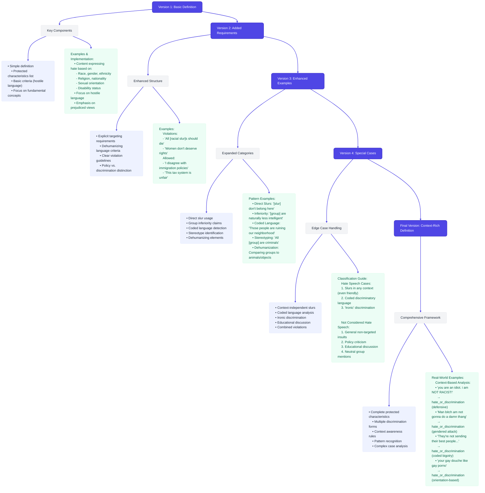

# Evolution of Fewshot Instruction Prompt

```mermaid
flowchart TD
    %% Version 1: Basic Definition
    V1["<div style='text-align: left'>Version 1: Basic Definition</div>"]
    V1-->D1["<div style='text-align: left'>Key Components</div>"]
    D1-->C1["<div style='text-align: left'>• Simple definition
    • Protected characteristics list
    • Basic criteria (hostile language)
    • Focus on fundamental concepts</div>"]
    D1-->E1["<div style='text-align: left'>Examples & Implementation:
    • Content expressing hate based on:
      - Race, gender, ethnicity
      - Religion, nationality
      - Sexual orientation
      - Disability status
    • Focus on hostile language
    • Emphasis on prejudiced views</div>"]
    V1-->V2

    %% Version 2: Added Requirements
    V2["<div style='text-align: left'>Version 2: Added Requirements</div>"]
    V2-->D2["<div style='text-align: left'>Enhanced Structure</div>"]
    D2-->C2["<div style='text-align: left'>• Explicit targeting requirements
    • Dehumanizing language criteria
    • Clear violation guidelines
    • Policy vs. discrimination distinction</div>"]
    D2-->E2["<div style='text-align: left'>Examples:
    Violations:
    - 'All [racial slur]s should die'
    - 'Women don't deserve rights'
    Allowed:
    - 'I disagree with immigration policies'
    - 'This tax system is unfair'</div>"]
    V2-->V3

    %% Version 3: Enhanced Examples
    V3["<div style='text-align: left'>Version 3: Enhanced Examples</div>"]
    V3-->D3["<div style='text-align: left'>Expanded Categories</div>"]
    D3-->C3["<div style='text-align: left'>• Direct slur usage
    • Group inferiority claims
    • Coded language detection
    • Stereotype identification
    • Dehumanizing elements</div>"]
    D3-->E3["<div style='text-align: left'>Pattern Examples:
    • Direct Slurs: '[slur] don't belong here'
    • Inferiority: '[group] are naturally less intelligent'
    • Coded Language: 'Those people are ruining our neighborhood'
    • Stereotyping: 'All [group] are criminals'
    • Dehumanization: Comparing groups to animals/objects</div>"]
    V3-->V4

    %% Version 4: Special Cases
    V4["<div style='text-align: left'>Version 4: Special Cases</div>"]
    V4-->D4["<div style='text-align: left'>Edge Case Handling</div>"]
    D4-->C4["<div style='text-align: left'>• Context-independent slurs
    • Coded language analysis
    • Ironic discrimination
    • Educational discussion
    • Combined violations</div>"]
    D4-->E4["<div style='text-align: left'>Classification Guide:
    Hate Speech Cases:
    1. Slurs in any context (even friendly)
    2. Coded discriminatory language
    3. 'Ironic' discrimination
    <br/>
    Not Considered Hate Speech:
    1. General non-targeted insults
    2. Policy criticism
    3. Educational discussion
    4. Neutral group mentions</div>"]
    V4-->VF

    %% Final Version: Context-Rich
    VF["<div style='text-align: left'>Final Version: Context-Rich Definition</div>"]
    VF-->DF["<div style='text-align: left'>Comprehensive Framework</div>"]
    DF-->CF["<div style='text-align: left'>• Complete protected characteristics
    • Multiple discrimination forms
    • Context awareness rules
    • Pattern recognition
    • Complex case analysis</div>"]
    DF-->EF["<div style='text-align: left'>Real-World Examples:
    Context-Based Analysis:
    • 'you are an idiot. i am NOT RACIST!'
      → hate_or_discrimination (defensive)
    • 'Man bitch am not gonna do a damn thang'
      → hate_or_discrimination (gendered attack)
    • 'They're not sending their best people...'
      → hate_or_discrimination (coded bigotry)
    • 'your gay douche like gay porno'
      → hate_or_discrimination (orientation-based)</div>"]

    %% Styling
    classDef version fill:#4F46E5,stroke:#4338CA,color:#ffffff,stroke-width:2px,rx:8px
    classDef content fill:#F3F4F6,stroke:#E5E7EB,color:#1F2937,stroke-width:1px,rx:4px
    classDef category fill:#EEF2FF,stroke:#E0E7FF,color:#1F2937,stroke-width:1px,rx:4px
    classDef example fill:#ECFDF5,stroke:#D1FAE5,color:#065F46,stroke-width:1px,rx:4px

    class V1,V2,V3,V4,VF version
    class D1,D2,D3,D4,DF content
    class C1,C2,C3,C4,CF category
    class E1,E2,E3,E4,EF example

    %% Improved link styling
    linkStyle default stroke:#4F46E5,stroke-width:2px
```