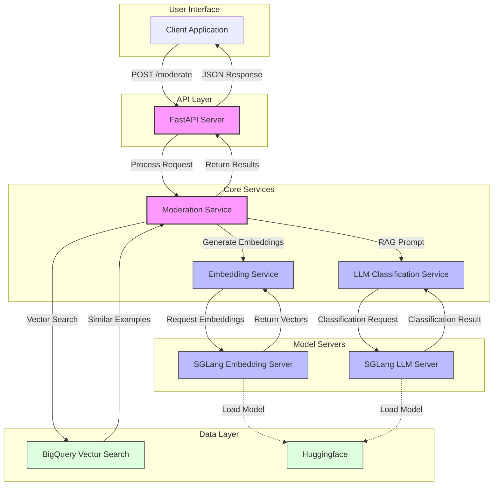

# Content Moderation System

A production-ready content moderation system using BigQuery vector search, SGLang servers, and LLM classification.

## Overview

This system provides a RESTful API for content moderation that classifies text into the following categories:

- **hate_or_discrimination**: Content targeting protected characteristics with negative intent/prejudice
- **violence_or_threats**: Content that threatens, depicts, or promotes violence
- **offensive_language**: Hostile or inappropriate content WITHOUT targeting protected characteristics
- **nsfw_content**: Explicit sexual content or material intended to arouse
- **spam_or_scams**: Deceptive or unsolicited content designed to mislead
- **clean**: Content that is allowed and doesn't fall into above categories

The system uses a Retrieval Augmented Generation (RAG) approach with BigQuery vector search to find similar examples, then constructs a prompt for an LLM to classify the content.

## Environment Setup

### Required Environment Variables

The following environment variables are **required** to run the system:

- **HF_TOKEN**: Hugging Face token for downloading models
- **GCP_CREDENTIALS**: GCP credentials JSON for BigQuery and GCS access
- **FLY_IO_DEPLOY_TOKEN**: Required only if deploying to fly.io (add to GitHub secrets)
- **API_KEY**: The API key for securing API endpoints (recommended for production use)

Set up environment variables:

```bash
# Source environment variables if you have an .env file
source .env
# Or generate GCP credentials in the correct format
GCP_CREDENTIALS=$(jq . 'credentials.json')
API_KEY=asdfjkl # <get this from secrets>
```

### For failures in cuda runtime / nvidia issues

```
# setup nvidia-container-runtime
wget -q https://developer.download.nvidia.com/compute/cuda/repos/ubuntu2204/x86_64/cuda-keyring_1.1-1_all.deb \
    && dpkg -i cuda-keyring_1.1-1_all.deb \
    && apt-get update \
    && apt-get install -y --no-install-recommends \
    cuda-nvcc-12-4 \
    cuda-cudart-dev-12-4 \
    nvidia-utils-535
```

### setting up venv and startup

```bash
# install uv
echo "Installing UV..."
curl -LsSf https://astral.sh/uv/install.sh | sh
source ~/.bashrc
source ~/.profile
```


```bash
# make venv
uv venv .venv --python=3.10
source .venv/bin/activate
```

```bash
# install dependencies
uv pip install -r requirements_master.txt
```

```bash
# run startup dev script
bash startup_dev.sh
```

### Configuration Options

Configuration is managed through `config.py`, with the following key settings:

#### Server Settings
- `SERVER_HOST`: Host to bind server (default: "0.0.0.0")
- `SERVER_PORT`: Port to bind server (default: 8080)
- `DEBUG`: Enable debug mode (default: false)
- `API_KEY`: API key for securing endpoints (default: "None" - authentication disabled)

#### Model Settings
- `LLM_MODEL`: LLM model name (default: "microsoft/Phi-3.5-mini-instruct")
- `EMBEDDING_MODEL`: Embedding model name (default: "Alibaba-NLP/gte-Qwen2-1.5B-instruct")
- `LLM_URL`: URL of LLM API (default: "http://localhost:8899/v1")
- `EMBEDDING_URL`: URL of embedding API (default: "http://localhost:8890/v1")

You can override defaults in a `.env` file or via environment variables.

## Security

### API Key Authentication

The API requires API key-based authentication for all endpoints:

1. All requests to API endpoints must include a valid API key in the `X-API-Key` header
2. Requests without a valid API key will be rejected with a 401 or 403 status code
3. The server will not start or will respond with a 500 error if no API key is configured

To configure API key authentication:

1. Set the `API_KEY` environment variable to your chosen API key:
   ```bash
   # Generate a secure random API key
   export API_KEY=$(openssl rand -hex 32)
   # Or set a specific key
   export API_KEY="your-secure-api-key"
   ```

2. This is a required setting - the API will not function without a valid API key configured

When making requests, include the API key in the header:

```bash
curl -X POST http://localhost:8080/moderate \
  -H "Content-Type: application/json" \
  -H "X-API-Key: 1dffeb8bafd536f4a1c8720282263e55d85f4284810bc7b150a831008f3e65d0" \
  -d '{"text": "win a 100% lottery on gifts worth 5000$!!!! win nowww!", "num_examples": 3}'
```

## GPU Configuration

### Development Environment (Theta)

If using 2xT4 machine in the Theta environment:

1. Uncomment `os.environ["CUDA_VISIBLE_DEVICES"] = "0"` in server_sglang.py file for one server
2. Uncomment `os.environ["CUDA_VISIBLE_DEVICES"] = "1"` in server_sglang.py file for the other server

### Production Environment

In production, we use single larger GPU instances:

- L40S GPU (48GB) is recommended and more cost-efficient than A10 (24GB)
- The scripts have been tested on both A10 and L40S GPUs on fly.io

See [Fly.io GPU pricing](https://fly.io/docs/about/pricing/#gpus-and-fly-machines) for more details.

## Setup Options

### Production Docker Setup (if you have GPU on local machine)

1. Build the Docker image:
```bash
docker build -t mod-server -f src_deploy/gpu.Dockerfile .
```

2. Run the container:
```bash
docker run -p 8080:8080 -t mod-server --env-file .env
```

### Development Setup (if you have GPU on Theta)

1. Set up the Theta environment:
```bash
bash /root/content-moderation/setup/remote/theta_env.sh
```

2. Run the development startup script:
```bash
bash /root/content-moderation/src_deploy/startup_dev.sh
```

The startup script:
- Creates log directories
- Sets up PYTHONPATH for imports
- Starts SGLang servers (embedding and LLM)
- Waits for servers to be ready
- Launches the FastAPI server

## Testing

### API Endpoints

1. Health check:
```bash
curl http://localhost:8080/health -H "X-API-Key: your-api-key-here"
```

2. Moderation API:
```bash
curl -X POST http://localhost:8080/moderate \
  -H "Content-Type: application/json" \
  -H "X-API-Key: your-api-key-here" \
  -d '{"text": "WIN A 100% lottery on gifts worth 5000$!!!! WIN nowww!", "num_examples": 3, "max_input_length": 2000, "max_tokens": 128}'
```

Sample response:
```json
{
  "query": "WIN A 100% lottery on gifts worth 5000$!!!! WIN nowww!",
  "category": "spam_or_scams",
  "raw_response": "Category: spam_or_scams\nConfidence: HIGH\nExplanation: The text is promoting a lottery with a high monetary prize, which is a common characteristic of spam or scam messages.",
  "similar_examples": [
    {"text": "Please call our customer service representative on 0800 169 6031 between 10am-9pm as you have WON a guaranteed £1000 cash or £5000 prize!", "category": "spam_or_scams", "distance": 0.19241894926451408},
    {"text": "Win the newest Harry Potter and the Order of the Phoenix (Book 5) reply HARRY, answer 5 questions - chance to be the first among readers!", "category": "spam_or_scams", "distance": 0.22693733793298976},
    {"text": "important information 4 orange user . today is your lucky day!2find out why log onto http://www.urawinner.com THERE'S A FANTASTIC SURPRISE AWAITING YOU!", "category": "spam_or_scams", "distance": 0.2426025591280332}
  ],
  "prompt": "Here are some example classifications:\n\nText: Please call our customer service representative on 0800 169 6031 between 10am-9pm as you have WON a guaranteed £1000 cash or £5000 prize!\nCategory: spam_or_scams\n\nText: Win the newest Harry Potter and the Order of the Phoenix (Book 5) reply HARRY, answer 5 questions - chance to be the first among readers!\nCategory: spam_or_scams\n\nText: important information 4 orange user . today is your lucky day!2find out why log onto http://www.urawinner.com THERE'S A FANTASTIC SURPRISE AWAITING YOU!\nCategory: spam_or_scams\n\nNow, please classify this text:\nWIN A 100% lottery on gifts worth 5000$!!!! WIN nowww!",
  "embedding_used": "Alibaba-NLP/gte-Qwen2-1.5B-instruct",
  "llm_used": true,
  "timing": {
    "embedding_time_ms": 84.55300331115723,
    "llm_time_ms": 3811.6366863250732,
    "bigquery_time_ms": 4219.695568084717,
    "total_time_ms": 8122.987747192383
  }
}
```

## How It Works

1. **Text Embedding**: Input text is converted to an embedding vector
2. **Vector Search**: BigQuery finds similar examples using vector similarity
3. **RAG Prompt**: Similar examples are used to build a few-shot prompt
4. **LLM Classification**: The LLM analyzes the text and provides classification
5. **Response Processing**: Results are structured and returned with metadata

The system is designed with graceful degradation - if components fail, it falls back to simpler alternatives.

## Architecture

